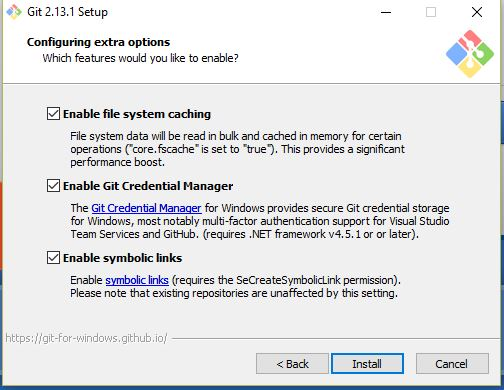

  <a href = "https://bit.ly/3MiJhDp">Register Here</a>

## Table of Contents

* [Introduction](#introduction)
* [Text Editors](#text-editors)
* [Installing Git](#installing-git)
* [Seeking Help](#seeking-help)

Introduction
----

Thank you for your interest in this workshop!
Git is a system for managing snapshots of plain text projects.
It is widely used in industry and academia for distributed collaboration amongst programmers.
It is also useful to individuals who want to manage and back up plain text projects across multiple devices.
GitHub is a popular website for hosting projects that use Git.

This workshop will provide a gentle introduction to Git and GitHub aimed at a general audience.
Since Git is most often used in a text-based environment,
we will also cover some simple use of the Unix command line.
The goal of the workshop is that you will attain some idea of what Git is and how to begin using it.

### Required Software

You will need software for editing plain text files and for using Git.
More detailed software suggestions and instructions are below.

You must have the software downloaded before the workshop.

You should also do some basic sanity checks to ensure that it works correctly.
At a minimum, you must be able to open a terminal and run `git --version` without seeing any errors.
You must also be able to edit plain text files.

Text Editors
----

The workshop will require you to have access to a _plain text editor_.
Some common text editors include Notepad, VS Code, Atom, Vim and Emacs.
Some text editors are easier to use than others, and some offer more features.

Notepad is easy to use but has minimal features.

Installing Git
----

Although Git is cross platform, each operating system offers different installation methods.
We are still evaluating which methods will be optimal for our workshops.

Have a look through the available options and choose one that seems suitable to you.
You may need to try more than one to find a good fit for you and your system.

* [Windows](#windows)
* [Mac OS X](#mac)
* [Linux](#linux)

### Windows

There are two or three main ways to install Git in Windows,
depending on which version of Windows you are running.

#### Git for Windows

This installer comes along with a CLI version of Git, which is quite powerful.
Download the installer from https://git-for-windows.github.io/ and run it.

You will be offered several options.
The default options should be safe.
The following screenshots show the options we tested with.

#### Ubuntu for Windows 10

This is the most powerful method, but it is quite complicated to set up.
It offers a Linux-like environment within Windows 10.

Before you proceed with this method,
you should know that Linux is an operating system often used in small devices like wifi routers and Android phones,
and large high-performance servers.

[Ubuntu](https://www.ubuntu.com/) is a Linux _distribution_,
meaning a collection of software that can manage what is installed on a Linux system.
There are a lot of Linux distributions;
Ubuntu is often recommended to people who are new to Linux.

Normally Linux and Windows programs don't work well together.
When _Ubuntu for Windows 10_ is activated,
it acts as a translator between Linux and Windows,
so now they can work with each other.

If you want to use this method for installing Git,
you should first [activate Ubuntu for Windows by following this tutorial](http://www.omgubuntu.co.uk/2016/08/enable-bash-windows-10-anniversary-update).

Once you have your Ubuntu environment active,
you will need to install Git by running:

~~~
sudo apt-get install git
~~~

We have not tested it, but you possibly also need to install Atom from within Ubuntu:

~~~
sudo apt-get install atom
~~~

### Mac OS X

For the workshop, we will be using Git on the command line in a terminal.
Fortunately, all Macs come with a terminal program.

Unfortunately, it is not obvious how to find it.
Many Mac users don't even know they already have this extremely powerful tool at their fingertips, ready to go.

[This tutorial by Jim Hoskins](http://blog.teamtreehouse.com/introduction-to-the-mac-os-x-command-line)
provides an introduction to the terminal in Mac OS X,
including how to find and open it.

Once you can open a terminal,
there are multiple methods for installing Git.
[These instructions summarise the available methods.](https://www.atlassian.com/git/tutorials/install-git#mac-os-x)

The XCode method is probably simplest, although it is a very large download.
Homebrew is a popular alternative.

### Linux

Since Git is used to version control Linux itself,
most Linux distributions make it very easy to install Git.

If you are attending the workshop with a Debian-like laptop (for example, if it
is running Ubuntu or Mint), you can install Git using _Synaptic_,
which is a graphical interface for package management.
You can hopefully find Synaptic in the menus offered by your desktop environment.

To install Git from the command line in either Debian-like or Red Hat-like
systems, see instructions [here](https://www.atlassian.com/git/tutorials/install-git#linux).

If you are running some other distribution,
you probably know what you are doing and can find your own help :)

Seeking Help
----

The workshop instructor has experience with Windows, a little experience with Linux, and minimal experience with Mac OS X.
Therefore, the instructor's ability to solve problems you encounter on Linux and Windows would probably just amount to doing a bunch of Googling for you.

So, if you face some challenges when installing Git,
please do your own Googling _first_,
before contacting the workshop admins for tech support.

However, if you have a problem that you just can't solve even after serious Googling for an hour or two,
please definitely contact the instructor as soon as possible!

We hope you can feel empowered to solve problems independently,
but we don't want you to frustratedly bang your head against the wall for days :)

See you at the workshop!
